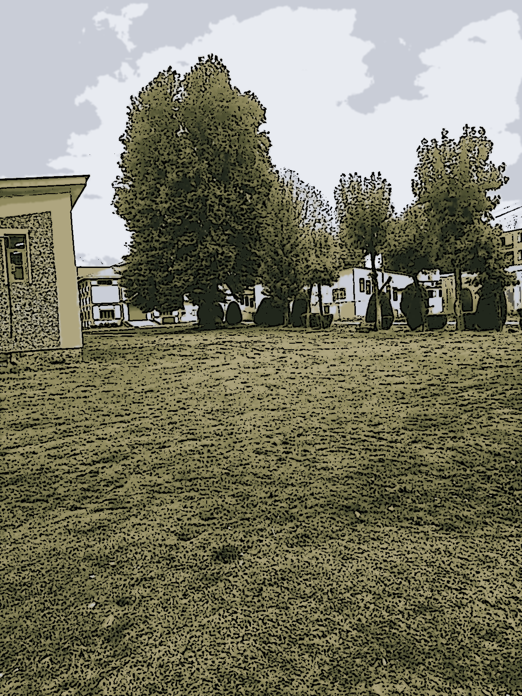

# Cartoonify Image with OpenCV

This project uses OpenCV to convert an input image into a cartoon-like version. It applies edge detection, color quantization, bilateral filtering, and masking techniques to achieve the cartoon effect.

## How to Use

1. Clone the repository:
2. Install the required libraries (OpenCV, NumPy, Matplotlib, Pillow) if you haven't already:
3. Run the script:

4. Find the resulting cartoon image as `cartoon_image.png`.

## Example

Here's an example of the conversion process:

 
 

## Customize

You can customize the settings for edge detection, color quantization, and bilateral filtering by modifying the `CartoonEffect.py` script.

## Acknowledgments

- Thanks to [OpenCV](https://opencv.org/) for providing powerful image processing capabilities.
